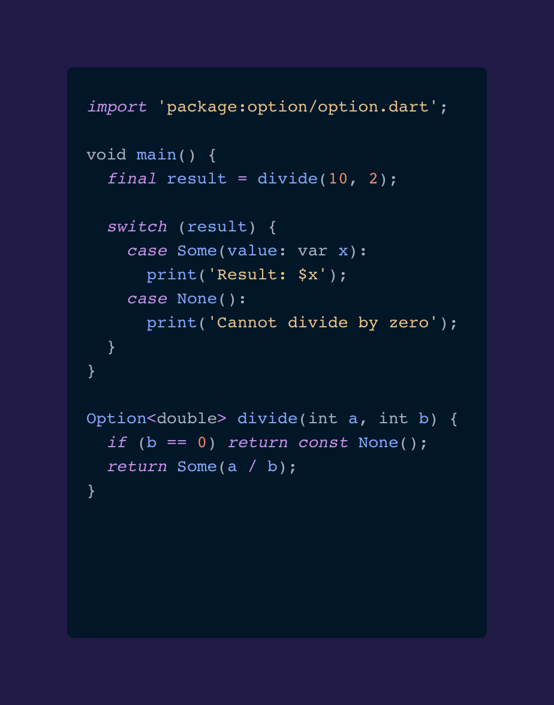

# Dart Option Type

A type-safe way to handle optional values in Dart without using null. This implementation provides a sealed `Option<T>` class with two variants: `Some<T>` and `None<T>`.



## Features

- Type-safe handling of optional values
- No null checks required
- Pattern matching support through sealed class
- Immutable implementation
- Generic type support

## Installation

Add this to your package's `pubspec.yaml` file:

```yaml
dependencies:
  option: ^1.0.0
```

## Usage

### Basic Usage

```dart
// Creating Options
final someValue = Some(42);
final noValue = None<int>();

// Pattern matching
Option<int> getValue() => Some(42);

final result = switch (getValue()) {
  Some(value: var x) => 'Got value: $x',
  None() => 'No value',
};
```

### Practical Examples

#### Handling Division

```dart
Option<int> divide(int a, int b) {
  if (b == 0) return const None();
  return Some(a ~/ b);
}

void main() {
  final result1 = divide(10, 2); // Some(5)
  final result2 = divide(10, 0); // None()
  
  switch (result1) {
    case Some(value: var x):
      print('Result: $x');
    case None():
      print('Division by zero');
  }
}
```

#### Working with APIs

```dart
Option<User> findUser(String id) {
  final user = database.query(id);
  return user != null ? Some(user) : const None();
}

void processUser(String id) {
  final userOption = findUser(id);
  
  switch (userOption) {
    case Some(value: var user):
      print('Found user: ${user.name}');
    case None():
      print('User not found');
  }
}
```

## Why Use Option?

1. **Type Safety**: Forces explicit handling of the absence of a value
2. **Clear Intent**: Makes it obvious when a value might be absent
3. **Pattern Matching**: Works well with Dart's pattern matching features
4. **No Null Checks**: Eliminates the need for null checks and related bugs

### Instead of Null

```dart
// Instead of this:
String? nullable = null;
if (nullable != null) {
  print(nullable.length);
}

// You can write this:
Option<String> option = const None();
switch (option) {
  case Some(value: var str):
    print(str.length);
  case None():
    print('No string provided');
}
```

## API Reference

### Option<T>

Base sealed class for optional values.

```dart
sealed class Option<T> {
  const Option();
}
```

### Some<T>

Represents the presence of a value.

```dart
class Some<T> extends Option<T> {
  const Some(this.value);
  final T value;
}
```

### None<T>

Represents the absence of a value.

```dart
class None<T> extends Option<T> {
  const None();
}
```

## Best Practices

1. Always use const constructors when possible:
   ```dart
   const none = None<int>();
   const some = Some(42);
   ```

2. Specify generic types explicitly when creating None:
   ```dart
   final option = None<String>(); // Good
   final option = None(); // Could lead to type inference issues
   ```

3. Use pattern matching for handling Options:
   ```dart
   switch (option) {
     case Some(value: var x):
       // Handle value
     case None():
       // Handle absence
   }
   ```

## Contributing

Contributions are welcome! Please feel free to submit a Pull Request.

## License

This project is licensed under the MIT License - see the LICENSE file for details.


## Author

Paurini Taketakehikuroa Wiringi
